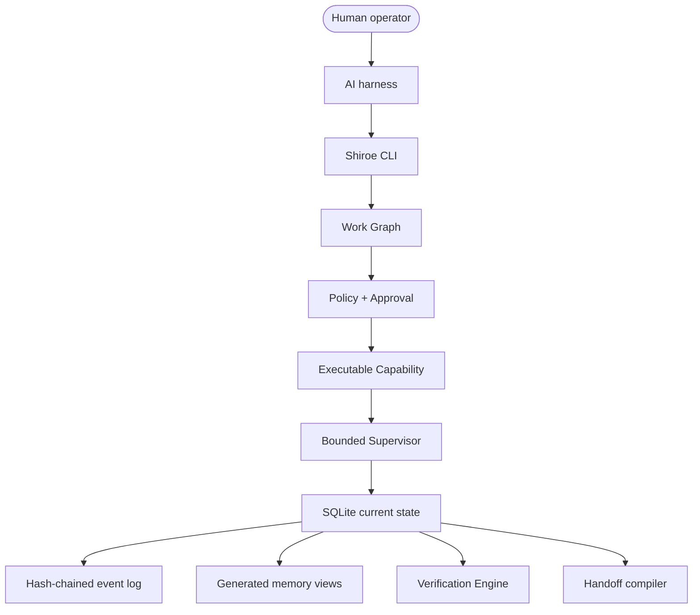

# Architecture

Shiroe is a local-first governance and continuity plane for AI-assisted work.
The harness supplies the model and editor. Shiroe supplies the operational
state, Work Graph, approval boundaries, capability control, verification,
memory, and handoff artifacts.

`AGENTS.md` is the canonical behavior specification for sessions. Storage
authority remains `docs/adr/ADR-0001-canonical-store.md`.

## Runtime shape

## Canonical state

Storage authority is [`ADR-0001`](../adr/ADR-0001-canonical-store.md), which
splits state three ways:

| Layer | Role |
|---|---|
| SQLite | The canonical current state for memory, Work Graphs, approvals, capabilities, and verification. |
| JSONL events | The canonical append-only history — hash-chained, replayable, immutable. |
| Markdown views | A generated human-readable view rebuilt from the two stores above; never the source of truth. |

Markdown views are rebuildable and disposable. Regenerating them must not
change canonical state.

## Work Graph

Work Graph is the only operational graph model. A graph contains typed nodes,
directed dependencies, readiness state, retry metadata, evidence requirements,
and approval requirements. Generic graph projections are not part of the active
runtime.

## Policy and approval

Policy denial takes precedence over lower-level grants. Approval is human-only,
bound to a deterministic scope digest, and becomes stale when that scope
changes. The Approval Advisor may recommend a decision, but it cannot authorize
or mutate approval state.

## Capabilities and execution

Only executable capabilities can run. Capability source digest drift snaps the
capability out of executable state before invocation. The supervisor runs a
bounded Work Graph, rechecks capability and policy state immediately before
execution, and records attempts in SQLite.

## Memory and verification

Memory writes flow through `MemoryService` into canonical SQLite and the event
log. Recall uses one deterministic token-overlap path. Verification centralizes
privacy, evidence, fact, contradiction, semantic review, write, and graph
checks.

## CLI surface

Public commands: `init`, `status`, `plan`, `run`, `approve`, `memory`,
`verify`, `handoff`, and `doctor`.

Operator commands: `policy`, `capability`, `state`, and `version`.

`node` is registered but hidden (`help=SUPPRESS`) — a parked, internal
node-registry surface, not part of the operational local benchmark CLI.

## Removed surfaces

Removed surfaces are tracked in [[../architecture/REMOVALS.md]]. Git history is
the archive for implementation details.

## Related

- [[Memory-Model]]
- [[Privacy-Model]]
- [[Glossary]]
